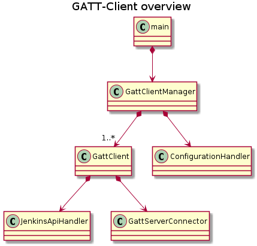

- [General](#general)
  - [Installation](#installation)
  - [systemd service](#systemd-service)
- [System Overview](#system-overview)
    - [Client Configuration](#client-configuration)
- [Development](#development)
  - [Setup Virtual Environment](#setup-virtual-environment)

# General

The **GATT client** is a **python3** daemon designed to run on a system with BLE support.

It polls the REST-API of jenkins servers to read the job states.
A jenkins-head (GATT server) represents the state of a group.

## Installation

TODO

## systemd service

TODO


# System Overview




### Client Configuration
The configuration of the client address and the jobs that should be monitored are represented as a YAML file e.g.
```yaml
groups:
  - name: "client Name (jenkins head1)"
    ble_mac: "BLE MAC"
    jenkins_jobs:
      jenkins_server1:
        - "/job/path/1" # optional user text
        - "/job/path/2" # this just the path without hostname
      jenkins_server2:
        - "/job/path" # optional user text
  - name: "jenkins head"
    ble_mac: "BLE MAC"
      jenkins_server1:
        - "http://..." # optional user text
        - "http://..."
jenkins_servers:
  jenkins_server1:
    name: "human readable name or discription"
    url: "http://<hostname>[:port]"
    authentication:
      - "username":
      - "key":
  jenkins_server2:
    name: "human readable name or discription"
    url: "http://<hostname>[:port]"
    authentication:
     - "username": "bot-user"
     - "key": "secret"
```

# Development

## Setup Virtual Environment 
create the virtual environment with the name `virtual-env`

```bash
python3 -m venv virtual-env
```

activate the virtual environment with the name `virtual-env`
```bash
source virtual-env/bin/activate
```

install all dependent packages 

```bash
pip3 install -r requirements.txt
```