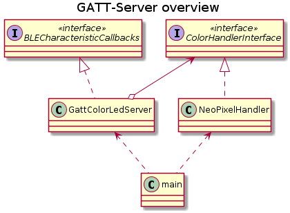

# General

This Project is based on [platformio.io](https://marketplace.visualstudio.com/items?itemName=platformio.platformio-ide#review-details) for the installation please follow the plug-in installation guide.

# BLE Interface
This GATT Server provides a service with the UUID `3bea760b-ea72-44d6-a189-2c27766bdcc4`. This service contains the following characteristics.

| characteristic | UUID |
| ---- | ---- |
| red | `2e252e00-2f8b-4326-91de-26742dda4aa7` |
| green | `6aeba5cd-4476-43b6-830b-021109ae6dea` |
| blue | `46f27bf3-5b1c-403e-bc20-90934a784e66` |
| brightness | `fc75589b-54ae-4b28-b54d-a35979f42b39` |

# System Overview

## GattColorLedServer
This class implements the **BLECharacteristicCallbacks** Interface to handles following functions
- `onRead`
- `onWrite`

This interface is part of the BLE stack

## ColorHandlerInterface

This interface abstract a handler that can handle a RGB LED.

## NeoPixelHandler

This class implements the `ColorHandlerInterface` to handle the `setColor` function and controls a NEO Pixel(s).