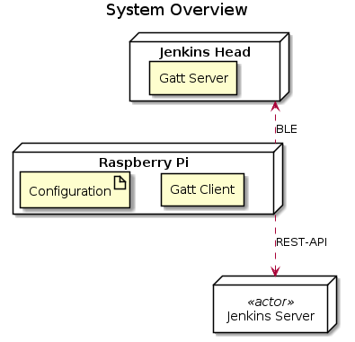
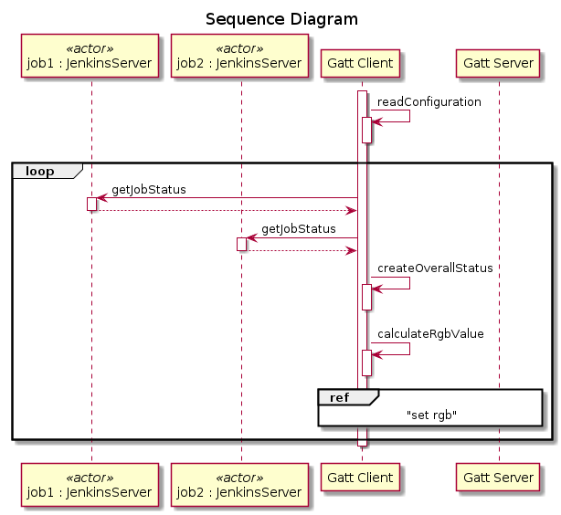

# jenkins-head
This repository contains gatt-server and gatt-client software. The Main goal of this project is, to visualize the Jenkins state with a jenkins figure :)

TODO: add picture of the jenkins head

# system overview

## GATT Client
The GATT Client collects the state of all registered Jenkins jobs. (see more details [here](BLE-GATT-Client/README.md))
The Jobs are organised in groups. The state of a group is visualized with a Jenkins head (BLE Server)
A state is represented as an **RGB** value pushed by the GATT Client to the GATT Server (Jenkins Head).

## GATT Sever
The GATT Server is colouring the jenkins head regarding the **RGB** value that is set from the GATT client. For further information see the documentation of the [GATT Server](BLE-GATT-Server/README.md) documentation.

# Sequence

