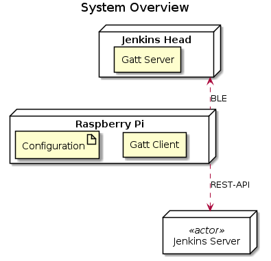

# jenkins-head
This repository contains gatt-server and gatt-client software. The Main goal of this project is, to visualize the Jenkins state with a jenkins figure :) 

TODO: add picture of the jenkins head

# system overview




## GATT Client
The GATT Client collects the state of all registered Jenkins jobs. After that the server joins all states to one global state. This global state is represented as an **RGB** value after that this value is pushed by the GATT Client to the GATT Server (Jenkins Head).

### Client Configuration
The configuration of the client address and the jobs that should be monitored are represented as a YAML file e.g.
```yaml
- clientName: "client Name (jenkins head1)"
  clientAddress: "BLE MAC"
  jenkinsJobs:
    - jobName: "job1"
      jobUrl: "http://..."
    - jobName: "job2"
      jobUrl: "http://..."

- clientName: "client Name2 (jenkins head2)"
  clientAddress: "BLE MAC2"
  jenkinsJobs:
    - jobName: "job3"
      jobUrl: "http://..."
    - jobName: "job4"
      jobUrl: "http://..."
```

## GATT Sever
The GATT Server is colouring the jenkins head regarding the **RGB** value that is set from the GATT client. For further information see the documentation of the [GATT Server](BLE-GATT-Sever/README.md) documentation.

# Sequence

